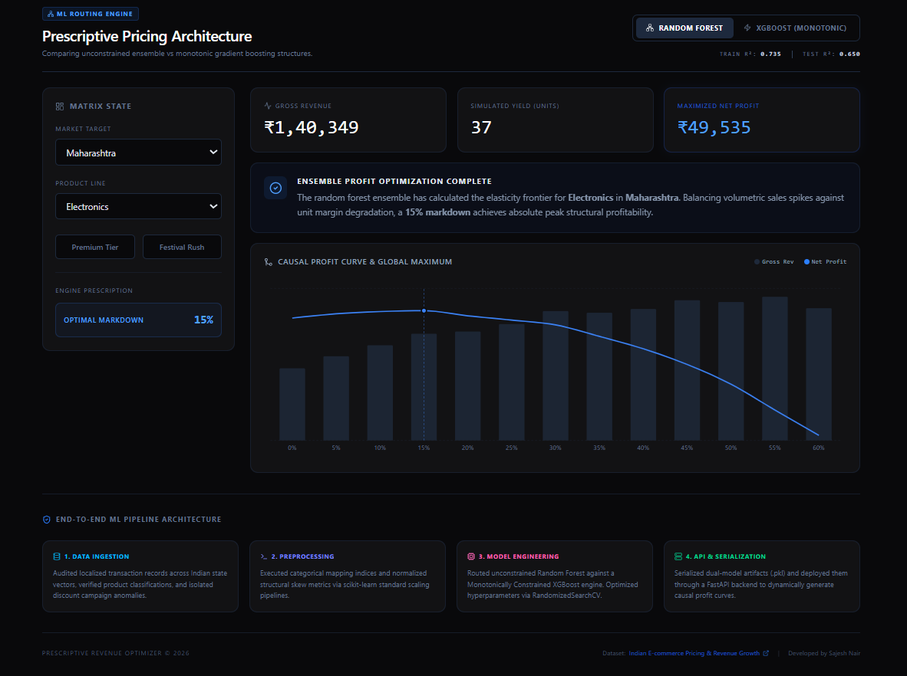

Prescriptive Pricing Architecture
Overview
This project introduces a Prescriptive Pricing Architecture designed to transition e-commerce strategy from reactive volume-chasing to proactive profit maximization. By leveraging ensemble machine learning models, the system identifies the "elasticity frontier"—the optimal price point where volume spikes and unit margin degradation are balanced to achieve peak structural profitability.

The Problem
E-commerce brands often rely on static discounting to drive short-term sales. While this clears inventory, it frequently erodes long-term profitability. There is often a disconnect between data-driven insights and actionable, prescriptive pricing strategies.

The Solution
This engine provides a prescriptive framework that:

Analyzes Elasticity: Uses historical data to model how pricing changes affect customer behavior.

Benchmarks Architectures: Provides comparative analysis between Monotonic XGBoost structures and Random Forest ensembles.

Automates Decisions: Recommends the specific markdown percentage needed to maximize net profit for given market segments and product lines.

Technical Architecture
The system is built as a full-stack, production-ready application:

ML Engine: Python, Scikit-learn, XGBoost.

Backend: FastAPI (providing low-latency inference for the dashboard).

Frontend: React.js integrated with Tailwind CSS for a responsive, high-performance UI.

Data Visualization: Recharts, integrated with Lucide-React for clean iconography.

Key Features
Segmented Analytics: Filter by Market Target and Product Line to see localized pricing behavior.

Profit Optimization: Real-time calculation of Gross Revenue vs. Net Profit.

Monotonic Constraint Handling: XGBoost implementation ensures pricing logic adheres to business-constrained growth/decay patterns.

Local Development
To run this project locally:

Clone the repository:

Bash
git clone https://github.com/sajesh-nair/Prescriptive-Pricing-Architecture.git
cd Prescriptive-Pricing-Architecture
Install Backend Dependencies:

Bash
pip install -r requirements.txt
uvicorn main:app --reload
Launch Frontend:

Bash
cd frontend
npm install
npm run dev
