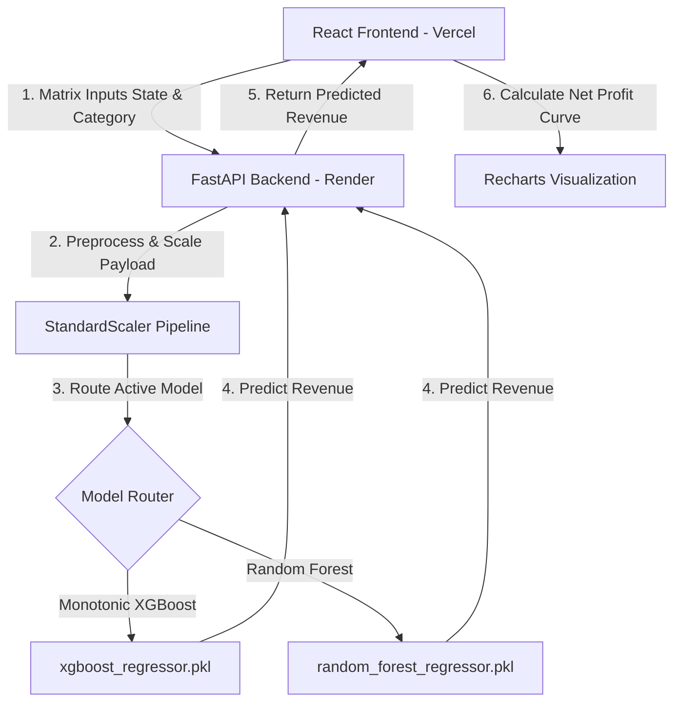

# Prescriptive Pricing Architecture

## Overview
This project introduces a **Prescriptive Pricing Architecture** designed to transition e-commerce strategy from reactive volume-chasing to proactive profit maximization. By leveraging ensemble machine learning models, the system identifies the **elasticity frontier**—the optimal price point where volume spikes and unit margin degradation are balanced to achieve peak structural profitability.

## The Problem
E-commerce brands often rely on static discounting to drive short-term sales. While this clears inventory, it frequently erodes long-term profitability. There is often a disconnect between data-driven insights and actionable, prescriptive pricing strategies.

## The Solution
This engine provides a prescriptive framework that:
- **Analyzes Elasticity:** Uses historical transaction data to model how pricing changes affect customer demand.
- **Benchmarks Architectures:** Provides comparative analysis between Monotonically Constrained XGBoost structures and Random Forest ensembles.
- **Automates Decisions:** Recommends the exact markdown percentage needed to maximize net profit for given market segments and product lines.

---

## Technical Architecture & Data Flow

```mermaid
graph TD
    A[React Frontend - Vercel] -->|1. Matrix Inputs State & Category| B[FastAPI Backend - Render]
    B -->|2. Preprocess & Scale Payload| C[StandardScaler Pipeline]
    C -->|3. Route Active Model| D{Model Router}
    D -->|Monotonic XGBoost| E[xgboost_regressor.pkl]
    D -->|Random Forest| F[random_forest_regressor.pkl]
    E -->|4. Predict Revenue| B
    F -->|4. Predict Revenue| B
    B -->|5. Return Predicted Revenue| A
    A -->|6. Calculate Net Profit Curve| G[Recharts Visualization]
```
System Stack
ML Engine: Python, Scikit-learn, XGBoost, Joblib.

Backend API: FastAPI running on Render (main.py).

Frontend Dashboard: React.js, Tailwind CSS, Lucide Icons, Recharts running on Vercel (App.jsx).

Key Features
Segmented Analytics: Filter by Market Target and Product Line to see localized pricing behavior across Indian state vectors.

Profit Optimization: Real-time calculation of Gross Revenue vs. Net Profit across discount intervals.

Monotonic Constraint Handling: XGBoost implementation ensures pricing logic adheres to business-constrained growth/decay patterns.

Local Development Setup
1. Clone the repository
Bash
git clone [https://github.com/sajesh-nair/Prescriptive-Pricing-Architecture.git](https://github.com/sajesh-nair/Prescriptive-Pricing-Architecture.git)
cd Prescriptive-Pricing-Architecture
2. Launch Backend
Bash
pip install -r requirements.txt
uvicorn main:app --reload
3. Launch Frontend
Bash
cd frontend
npm install
npm run dev
